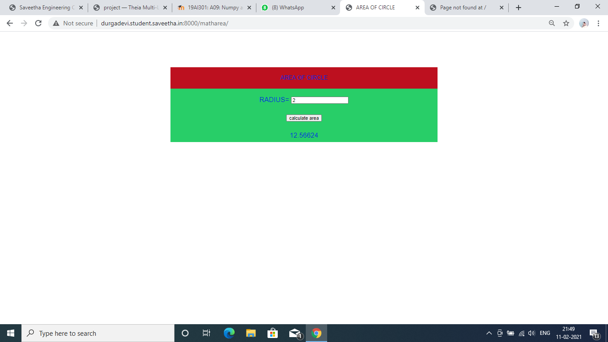
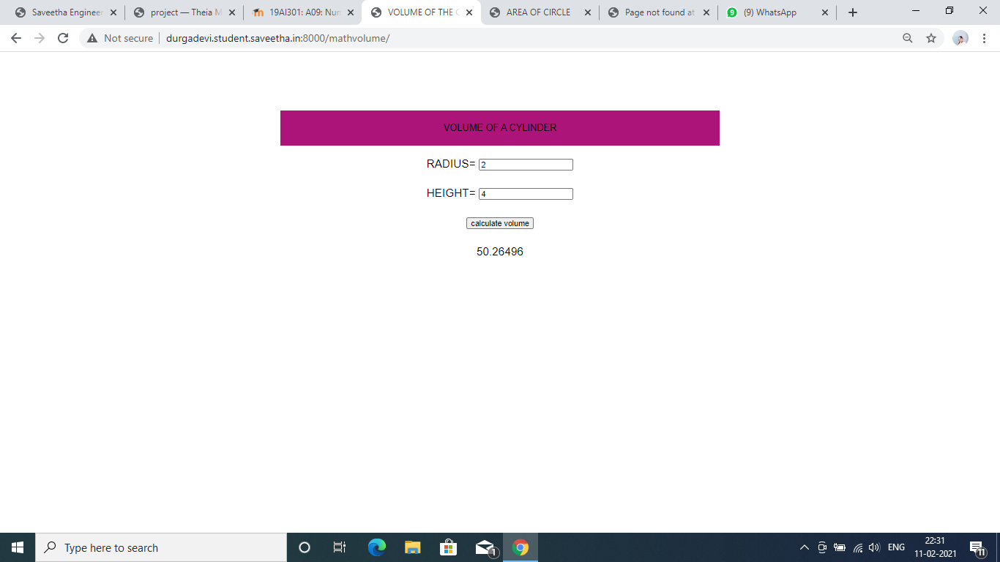
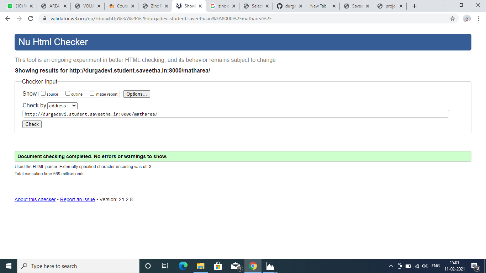
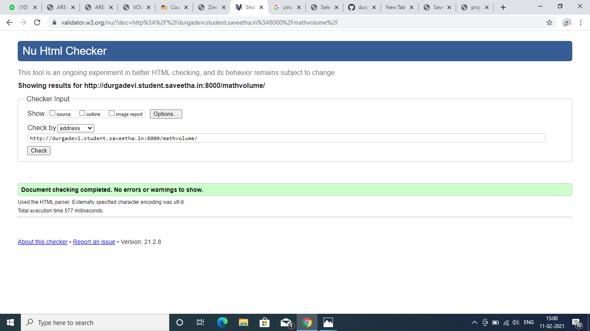

# Mathematical Calculations using JavaScript
## AIM:
To design a website to calculate the area of a circle and volume of a cylinder using JavaScript.

## DESIGN STEPS:
### Step 1: 
Requirement collection.
### Step 2:
Creating the layout using HTML and CSS.
### Step 3:
Write JavaScript to perform calculations.
### Step 4:
Choose the appropriate style and color scheme.
### Step 5:
Validate the layout in various browsers.
### Step 6:
Validate the HTML code.
### Step 6:
Publish the website in the given URL.


## PROGRAM:
### mathvolume.html
```

<!DOCTYPE html>
<html lang=en>

<head>
    <title>VOLUME OF THE CYLINDER</title>
    <link rel="stylesheet" href="">
</head>

<body>
    <div class="container">
        <div class="formview">
            <div class="banner">
                VOLUME OF A CYLINDER
            </div>
            <div class="content">
                <form action="/mathvolume/" method="POST">
                    
                    <div class="forminput">
                        <label for="value_radius">RADIUS=</label>
                        <input type="text" name="value_radius" id="value_radius" value="{{radius}}">
                    </div>
                    <div class="forminput">
                        <label for="value_height">HEIGHT=</label>
                        <input type="text" name="value_height" id="value_height" value="{{height}}">
                    </div>
                    <div class="forminput">
                        <button type="submit" name="button_volume" id="button_volume">calculate volume</button>
                    </div>
                    <div class="forminput">
                        {{result}}
                   </div>
                </form>
            </div>
        </div>
    </div>
    <script src="/static/js/mathscript.js"></script>
</body>

</html>

```

### matharea.html
```

<!DOCTYPE html>
<html lang=en>

<head>
    <title>AREA OF CIRCLE</title>
    <link rel="stylesheet" href="">
</head>

<body>
    <div class="container">
        <div class="formview">
            <div class="banner">
                AREA OF CIRCLE
            </div>
            <div class="content">
                <form action="/matharea/" method="POST">
                    
                    <div class="forminput">
                        <label for="value_radius">RADIUS=</label>
                        <input type="text" name="value_radius" id="value_radius" value="{{radius}}">
                    </div>
                    <div class="forminput">
                        <button type="submit" name="button_area" id="button_area">calculate area</button>
                    </div>
                    <div class="forminput">
                        {{result}}
                   </div>
                </form>
            </div>
        </div>
    </div>
    <script src="/static/js/mathscript1.js"></script>
</body>

</html>
```
### mathscript.js
```


volumeBtn = document.querySelector('#button_volume');

volumeBtn.addEventListener('click',function(e){
    alert('VOLUME button clicked');

    txtRADIUS = document.querySelector('#value_radius');
    txtHEIGHT = document.querySelector('#value_height');
    txtRESULT = document.querySelector('#value_result');

    let result;

    result = 3.14156*parseFloat(txtRADIUS.value)*parseFloat(txtRADIUS.value)*parseFloat(txtHEIGHT.value);

    txtRESULT.value = result;
});
```

### mathscript1.js
```
areaBtn = document.querySelector('#button_area');

areaBtn.addEventListener('click',function(e){
    alert('AREA button clicked');

    txtRADIUS = document.querySelector('#value_radius');
    txtRESULT = document.querySelector('#value_result');

    let result;

    result = 3.14156*parseFloat(txtRADIUS.value)*parseFloat(txtRADIUS.value);

    txtRESULT.value = result;
    
});

```

## OUTPUT:



## CODE VALIDATION REPORT:




## RESULT:
Thus a website is designed for the calculation of volume of cylinder and area of circle using JavaScript and is hosted in the URLs  http://durgadevi.student.saveetha.in:8000/mathvolume/, http://durgadevi.student.saveetha.in:8000/matharea/. HTML code is validated.